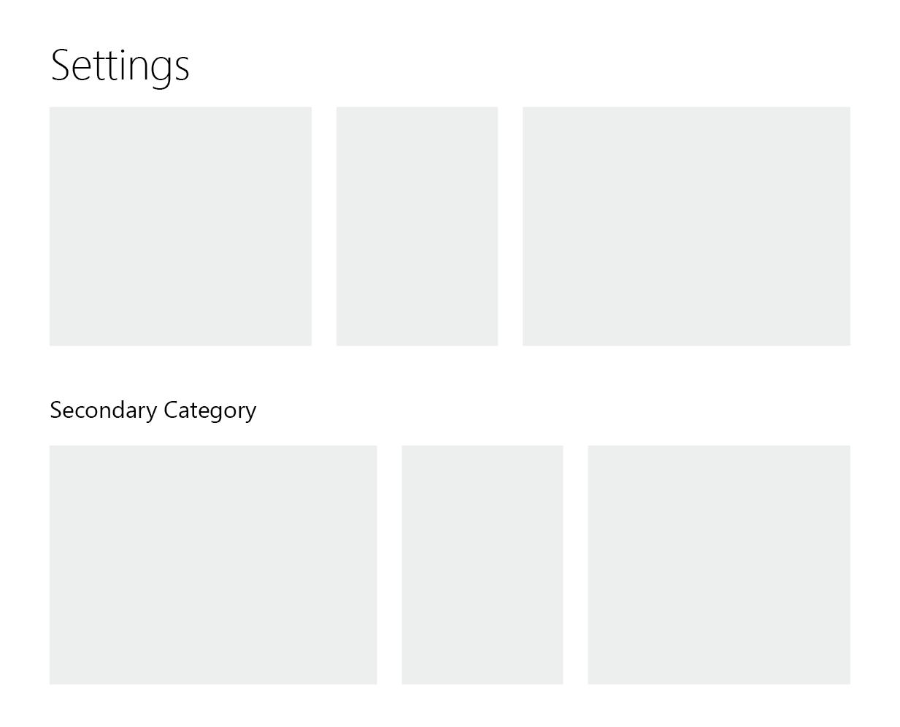

Architus bot settings are dynamically rendered, consumed, and validated based off of a JSON schema as detailed below.

## Get Guild Settings

<Route method="GET" path="/settings/{guild_id}" auth />

Gets the settings schema data for the current server.

## Top-level format

At the highest level, the Settings schema is composed of an array of category definitions, each of which contain one or more settings cards:

```json
{
  "categories": [
    ...
  ]
}
```

The reasoning behind having a top-level organization scheme of the `category` is to support a view that looks something like the following mockup, where multiple vertical sections would be possible, enabling large collections of settings
to be effectively categorized.



### Category Object

###### Category Structure

| Field  | Type                                          | Description                                                                   |
| ------ | --------------------------------------------- | ----------------------------------------------------------------------------- |
| title? | string                                        | if non-null, then this category will appear separate from the global category |
| cards  | array of [setting card](#card-object) objects | child cards within the category                                               |

Each card is configured individually, representing a collection of individual settings that fall under a given topic.

### Card Object

###### Card Structure

| Field    | Type                                        | Description                                                                          |
| -------- | ------------------------------------------- | ------------------------------------------------------------------------------------ |
| title    | string                                      | title string that appears at the top of the card once rendered                       |
| settings | array of [setting](#setting-object) objects | individual settings fields that are listed once rendered, ordered from top to bottom |

##### Card Example

```json
{
  "title": "Gulag",
  "settings": [
    {
      "key": "gulag_command",
      "label": "Command",
      "input_type": "string",
      "default": "gulag"
    },
    ...
  ]
}
```

## Settings

In order to be consumed on both the backend and the frontend, each Setting object contains a variety of information related to each setting entry.

### Setting Object

###### Setting Structure

| Field             | Type                                                             | Description                                                                                                                                                                                                                                                 |
| ----------------- | ---------------------------------------------------------------- | ----------------------------------------------------------------------------------------------------------------------------------------------------------------------------------------------------------------------------------------------------------- |
| key               | string                                                           | internal **unique** key used to access the setting across the application                                                                                                                                                                                   |
| label             | string                                                           | display text shown to the left of each setting _(Fewer than 25 characters)_                                                                                                                                                                                 |
| input_type        | string enum                                                      | type of input component used on the frontend. One of `["string", "numeric", "string_auto-complete", "string_highlighted", "switch", "array_auto-complete"]`                                                                                                 |
| default           | any                                                              | initial value of the setting used for newly initialized guilds                                                                                                                                                                                              |
| value             | any                                                              | current value of the setting                                                                                                                                                                                                                                |
| help_tooltip?     | string                                                           | text content of an optional [HelpTooltip](https://storybook.archit.us/?path=/story/helptooltip--basic) component                                                                                                                                            |
| properties?       | object                                                           | key-value pairs passed as props to the input component                                                                                                                                                                                                      |
| validation_steps? | array of Union<string, [validation](#validation-object) objects> | chain of validation steps necessary for the setting value to pass, ran on both the frontend and backend, unless otherwise specified (see [object information](#validation-object)). If a string, then the value represents the `key` of the individual step |
| cli?              | [cli object](#cli-object)                                        | if non-null, then includes the individual setting in the list of settings that can be edited in the Discord client using the `!settings`/`?settings` command                                                                                                |

##### Setting Example

```json
{
  "key": "starboard_threshold",
  "label": "Starboard Threshold",
  "input_type": "numeric",
  "default": 5,
  "value": 6,
  "properties": {
    "min": 0,
    "integer": true
  },
  "validation_steps": [
    "isNumber",
    "isInteger",
    { "key": "isInRange", "args": { "min": 0 } }
  ],
  "cli": {
    "name": "Starboard Threshold",
    "emote": "⭐",
    "message": "⭐ This is the number of reacts a message...",
    "input_mode": "replace"
  }
}
```
